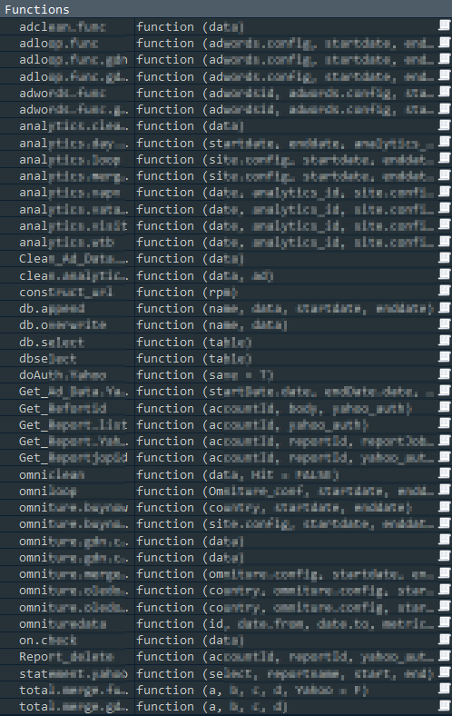
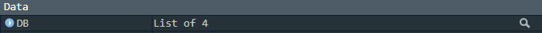
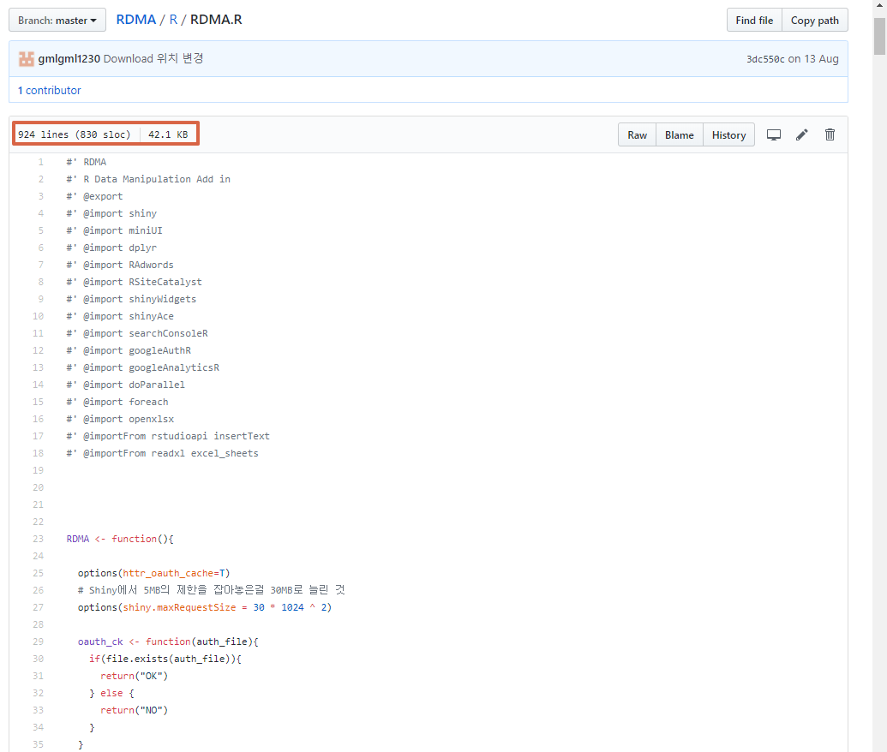
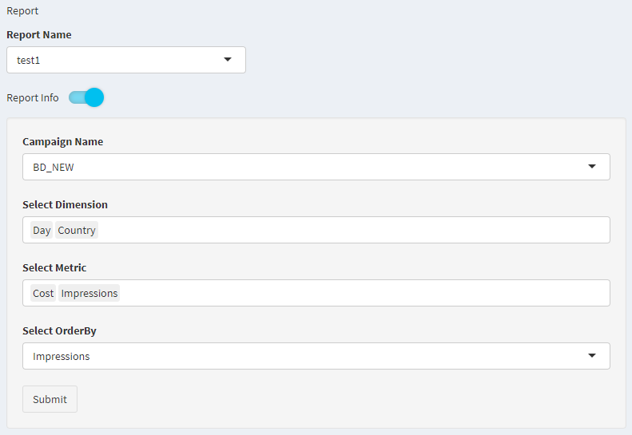

# Shiny Module

### 개요
RDMA의 UI, Server Code는 총 923줄로 이뤄져있으며, 총 4개의 탭이 존재 합니다.
각 탭마다 같은 기능을하고있는 부분이 존재하며 해당 기능의 코드를 각 탭에 추가하는 식으로 작성되어있습니다. 그렇기에 코드의 가독성이 좋지 않으므로 이를 해결하기위해 Shiny Module를 사용하게되었습니다.

### R Module
Shiny Module에 앞서 R의 함수를 Module로 만드는 작업
```
library(modules)

DB <- modules::module({
  # 외부 함수를 사용하기 위해선 Module 함수 안에서 Import를 해주어야함
  import("RMySQL")
  import("DBI")

  host <- "[IP]"

  # 데이터 조회
  db.select <- function(table){
    con <- RMySQL::dbConnect(MySQL(), user = "[user]", password = "[password]", dbname = "[dbname]", host = host, port = [port])
    tryCatch({
      data <- DBI::dbGetQuery(con, paste0("select * from ", table))
      RMySQL::dbDisconnect(con)
      print(paste("DB 조회 완료", print(Sys.time())))
      return(data)
    },
    error = function(e){
      RMySQL::dbDisconnect(con)
      print(e)
    })
  }

  # 테이블 덮어쓰기
  db. <- function(name,data){
    con <- RMySQL::dbConnect(MySQL(), user = "[user]", password = "[password]", dbname = "[dbname]", host = host, port = [port])
    tryCatch({
      DBI::dbWriteTable(con, name, data, overwrite = TRUE)
      RMySQL::dbDisconnect(con)
      print(paste("DB Insert 생성 완료", print(Sys.time())))
    },
    error = function(e){
      RMySQL::dbDisconnect(con)
      print(e)
    })
  }

  # 해당 날짜에 포함되는 데이터를 지운 후 삽입
  db.append <- function(name,data,startdate = NULL,enddate = NULL){
    con <- RMySQL::dbConnect(MySQL(), user = "[user]", password = "[password]", dbname = "[dbname]", host = host, port = [port])
    tryCatch({
      if(is.null(startdate)){dbGetQuery(con, paste0("delete from ", name, " where Day >='", startdate, "' AND Day <='", enddate, "'"))}
      DBI::dbWriteTable(con, name, data, append = TRUE)
      RMySQL::dbDisconnect(con)
      print(paste("DB Insert 완료", print(Sys.time())))
    },
    error = function(e){
      RMySQL::dbDisconnect(con)
      print(e)
    })
  }
})
```

```
DB$db.select
DB$db.overwrite
DB$db.append
```

<br>

- 기존 사용자 함수

<br>

- 모듈 사용 후 사용자 함수

### R Shiny Module
- 모듈을 사용하지 않았을 때

>만든 저조차도 어떤 것이 무슨 기능을하는지 찾기가 쉽지 않습니다. 제 코드를 한참 본 후 무슨 기능을 하기위해 만들었는지 떠올리게 됩니다. 하물며 제가 아닌 다른사람이 제 코드를 볼 때 이해하기 쉽지 않을 것이라 생각 됩니다.

<br>

- Module Function
```
library(modules)

shiny_module <-modules::module({
  import("shiny")

  # UI Function
  shiny_module.func <- function(id.chr){
    ns <- NS(id.chr)

    tagList(
      actionButton(ns("ok"), "OK"),
      verbatimTextOutput(ns("text"))
    )
  }


  # Server Function
  shiny_module_server.func <- function(input, output, session, ans){
    observeEvent(input$ok, {
      output$text <- renderText({ans})
    })
  }
})
```
> Shiny Module에서 가장 중요한 것은 NS Function으로 ID의 네임 스페이스를 지정해야합니다.
> 또한, Module안에는 tagList()에 여러 요소를 래핑시켜야합니다.

<br>

- UI function
```
source("~/ex_shiny/shiny_module.R")

ui <- fluidPage(
  titlePanel("Tabsets"),
  sidebarLayout(
    sidebarPanel(
    ),
    mainPanel(
      tabsetPanel(
        tabPanel("text1", shiny_module$shiny_module.func("text1")),
        tabPanel("text2", shiny_module$shiny_module.func("text2")),
        tabPanel("text3", shiny_module$shiny_module.func("text3"))
      )
    )
  )
)
```

<br>

- Server function
```
source("~/ex_shiny/shiny_module.R")

server <- function(input, output) {
  callModule(shiny_module$shiny_module_server.func, "text1", "안녕하세요")
  callModule(shiny_module$shiny_module_server.func, "text2", "모두들")
  callModule(shiny_module$shiny_module_server.func, "text3", "행복하세요")
}
```
>Server에 Module Function을 사용할 땐 callModule Function이 필요합니다.
>callModule의 인수는 callModule(모듈 서버 함수, ID, 추가 인수)

<br>

### R Shiny Module 심화 예제
- Module Function
```
library(shiny)
library(shinyWidgets)

source("[DB Script path]")

# ==============================================================
# UI
# ==============================================================

report_info_ui.func <- function(id.chr,reportlistorder.vec,reportmetric.vec,reportdimension.vec,campaign_list.vec = NULL){
  ns <- NS(id.chr)

  if(is.null(campaign_list.vec)){
    tagList(
      shinyWidgets::materialSwitch(ns("reportinfo"), "Report Info", status = "info"),
      conditionalPanel(condition = paste0("input['", ns("reportinfo"), "'] == true"),
                       wellPanel(
                         selectInput(inputId = ns("reportdimension"), label = "Select Dimension", choices = reportdimension.vec, multiple = TRUE),
                         selectInput(inputId = ns("reportmetric"), label = "Select Metric", choices = reportmetric.vec, multiple = TRUE),
                         selectInput(inputId = ns("reportorder"), label = "Select OrderBy", choices = reportlistorder.vec),
                         actionButton(inputId = ns("reportdb"), label = "Submit"),
                         verbatimTextOutput(ns("test"))
                       )
      )
    )
  } else {
    tagList(
      shinyWidgets::materialSwitch(ns("reportinfo"), "Report Info", status = "info"),
      conditionalPanel(condition = paste0("input['", ns("reportinfo"), "'] == true"),
                       wellPanel(
                         selectInput(inputId = ns("campaignlist"), label = "Campaign Name", choices = campaign_list.vec),
                         selectInput(inputId = ns("reportdimension"), label = "Select Dimension", choices = reportdimension.vec, multiple = TRUE),
                         selectInput(inputId = ns("reportmetric"), label = "Select Metric", choices = reportmetric.vec, multiple = TRUE),
                         selectInput(inputId = ns("reportorder"), label = "Select OrderBy", choices = reportlistorder.vec),
                         actionButton(inputId = ns("reportdb"), label = "Submit"),
                         verbatimTextOutput(ns("test"))
                       )
      )
    )
  }
}


# ==============================================================
# Server
# ==============================================================

report_info_server.func <- function(input, output, session, campaign_name.chr, reportname.chr){
  str.func <- function(text.chr){
    return(strsplit(text.chr, ",") %>% unlist())
  }
  if(campaign_name.chr == "kia"){
    report_info.df <- DB$db.select(paste0(campaign_name.chr, "_report_setting where reportname = '", reportname.chr, "'"))
    updateSelectInput(session, inputId = "campaignlist", selected = report_info.df$campaign)
    updateSelectInput(session, inputId = "reportdimension", selected = str.func(report_info.df$dimension))
    updateSelectInput(session, inputId = "reportmetric", selected = str.func(report_info.df$metric))
    updateSelectInput(session, inputId = "reportorder", selected = str.func(report_info.df$orderby))
  } else {
    report_info.df <- DB$db.select(paste0(campaign_name.chr, "_report_setting where reportname = '", reportname.chr, "'"))
    updateSelectInput(session, inputId = "reportdimension", selected = str.func(report_info.df$dimension))
    updateSelectInput(session, inputId = "reportmetric", selected = str.func(report_info.df$metric))
    updateSelectInput(session, inputId = "reportorder", selected = str.func(report_info.df$orderby))
  }
}

report_info_modi_server.func <- function(input, output, session, reportname.chr, campaign_name.chr, func, func2, func3, func4, func5, func6){
  if(campaign_name.chr == "kia"){
    observeEvent(input$reportdb, {
      campaign <- input$campaignlist
      dimension <- func(input$reportdimension)
      metric2 <- func2(input$reportmetric)
      metric <- func3(input$reportmetric)
      query <- func4(dimension, metric2, campaign)
      orderby <- input$reportorder
      func5(paste0("update ",campaign_name.chr,"_report_setting set campaign = '", campaign, "', dimension='", dimension, "', metric='", metric, "', orderby='", orderby, "', query='", query, "' where reportname='", reportname.chr, "'"))
      updateSelectInput(session, inputId = "reportlist", choices = func6()$reportname)
      showModal(modalDialog(title = "Important message", "Report 수정 완료!"))
    })
  } else {
    observeEvent(input$reportdb, {
      dimension <- func(input$reportdimension)
      metric2 <- func2(input$reportmetric)
      metric <- func3(input$reportmetric)
      query <- func4(dimension, metric2)
      orderby <- input$reportorder
      func5(paste0("update ",campaign_name.chr,"_report_setting set dimension='", dimension, "', metric='", metric, "', orderby='", orderby, "', query='", query, "' where reportname='", reportname.chr, "'"))
      updateSelectInput(session, inputId = "reportlist", choices = func6()$reportname)
      showModal(modalDialog(title = "Important message", "Report 수정 완료!"))
    })
  }
}
```
- UI function
```
report_info_ui.func("report_info", campaign_list, reportorderlist, reportmetriclist, reportdimensionlist)
```

- Server function
```
callModule(report_info_modi_server.func, "report_info", input$reportlist, "kia", textdimension.func, textmetric1.func, textmetric2.func, reportquery.func, MySQL_Send.func, reportlistupdate.func)
```
-

