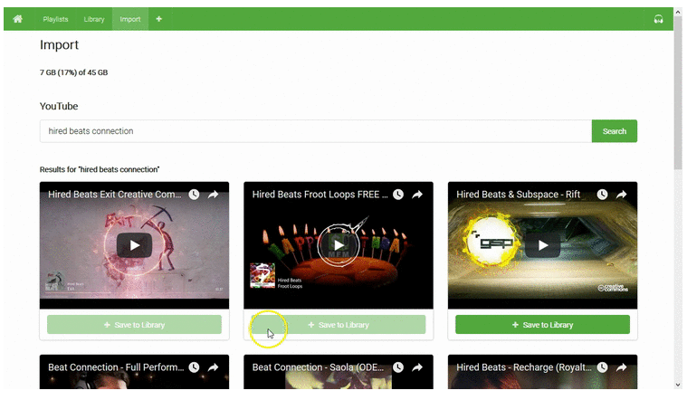
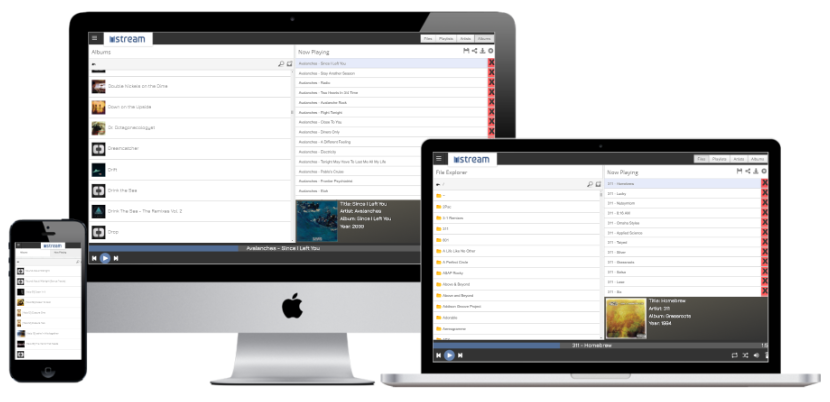

# Music Streaming Server

## 발단

R&D 준비와 라즈베리파이를 사용해보고 싶었던 저에게...

누군가(05D)의 작은 속삭임으로인하여 시작하게 되었습니다.

## 목적

아침마다 노래가 끊기는 현상으로인하여 계속해서 휴게실 컴퓨터를 새로고침해야 하는 번거로움을 줄이기위해 라즈베리파이로 스트리밍 서버를 만들고자했습니다.

## 과정

### 1. soundscape

- 선택하게 된 계기

> github에서 공개된 오픈소스 중 2위였으며, YouTube 영상을 가져와 저장할 수 있는 기능이 있었습니다.

- 작업 과정

```
# Install ffmpeg.
$ sudo apt-get update
$ sudo apt-get install -y wget ffmpeg

# Download the soundscape binary.
$ sudo wget -O /usr/bin/soundscape https://github.com/soundscapecloud/soundscape/raw/master/soundscape-linux-amd64

# Make it executable.
$ sudo chmod +x /usr/bin/soundscape

# Allow it to bind to privileged ports 80 and 443 as non-root (this is also a potential risk).
$ sudo setcap cap_net_bind_service=+ep /usr/bin/soundscape

# Create your soundscape directory.
$ mkdir $HOME/Music
# 이 과정은 진행하지 않아도 자동으로 경로를 생성한다.

# (optional) Set a password (or one will be generated and printed in the log)
$ echo "mypassword" >$HOME/Music/.authsecret
# 진행하지 않음

# Run with Let's Encrypt enabled for automatic TLS setup (your server must be internet accessible).
$ soundscape --http-host music.example.com --http-username $USER --data-dir $HOME/Music --letsencrypt
1.503869865804371e+09    info    Soundscape URL: https://music.example.com/soundscape/
1.503869865804527e+09    info    Login credentials:  <username>  /  <password>
# 위의 설정 중 비밀번호를 지정하지 않았기 때문에 일부만 사용
# soundscape --http-host 127.0.0.1:8000 --data-dir $HOME/Music --letsencrypt
```


> - 실행 후 127.0.0.1:8000으로 접속 시 연결이 가능했습니다.
> - 하지만, 유튜브 영상을 검색 후 영상을 저장하는 과정에서 라즈베리파이의 성능으로는 엄청 버벅이는 현상이 있었으며, 정상적인 소리가 출력되지않았습니다.

### 2. mStream

- 선택하게 된 계기
> github에서 공개된 오픈소스 중 1위입니다.
먼저 선택하지 않은 이유는 Youtube 영상을 가져오지 못했기 때문입니다.

- 작업 과정
```
# Using Ubuntu
curl -sL https://deb.nodesource.com/setup_8.x | sudo -E bash -
sudo apt-get install -y nodejs
# nodejs 8버전 이상으로 설치하지 않으면 밑의 과정이 이뤄지지 않습니다.

# Install From NPM
npm install -g mstream

# Install From Git
git clone https://github.com/IrosTheBeggar/mStream.git
cd mStream
npm install --only=production
sudo npm link

# change port (defaults to 3000)
mstream -p 4999
```


> - 실행 후 ... 어떻게 연결했는지 기억이나지 않습니다... 연결에는 성공했으며, 노래를 usb로 넣어줬지만 정상적으로 출력이되지 않았습니다.

### 3. Pi MusicBox

- 선택하게 된 계기
> 간단하게 설치하여 바로 사용할 수 있으며, 스마트폰, 노트북, 데스크톱 컴퓨터에서 조작하여 음악을 실행할 수 있습니다.

- 작업 과정
```
http://www.pimusicbox.com/
위의 사이트에서 이미지 파일을 설치하여 라즈베리파이 SD 카드에 넣어준 후 라즈베리파이를 실행하면 자동 실행 됩니다.
```

> - 처음에는 라즈베리파이에 모니터를 연결하여 보는 것을 추천드리며 실행 시 주소를 제공해줍니다. 해당 주소로 접속하면 조작이 가능합니다.
> - USB에 음악파일을 넣은 후 라즈베리파이를 실행하면 자동으로 음악파일을 체킹합니다.
> - 설명에는 Wifi를 주로 사용하지만 Lan을 직접 연결하여도 됩니다.
> - 앰프를 연결하면 바로 사용이 가능하지만, 블루투스연결은 지원을 안하고 있습니다. 라즈베리파이3 자체에 블루투스 기능이 있지만 pi MusicBox를 실행하는 rasbian 에서는 블루투스 기능을 사용할 수 없습니다.

## 결론

3번 시도했지만... 2번 실패 후 마지막에 성공은 했습니다.

휴게실에 랜선이 하나이기에 그것을 라즈베리파이에 연결한다면 회의실 현황을 확인 할 수 없게되기에 블루투스를 사용하고자 알아봤었습니다.

Pi MusicBox에서는 그 기능을 사용할 수 없기에 최선의 방식으로는 Wifi를 연결할 수 있는 와이파이 어댑터를 구입하여 연결하는 방식으로 한다면 휴게실에 라즈베리파이를 설치하고 앰프에 직접 연결하는 방식으로 진행이 가능할 것 같습니다.

이만... 저는... 공부할래요.......... ㅜ^ㅜ.....
