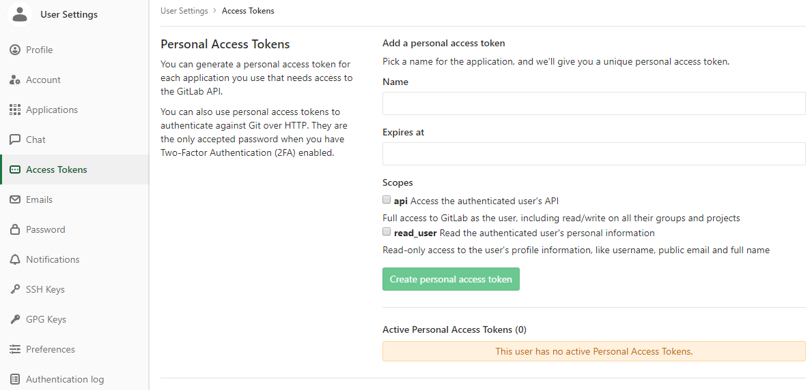
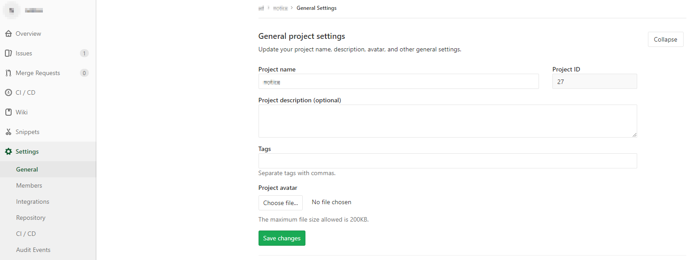
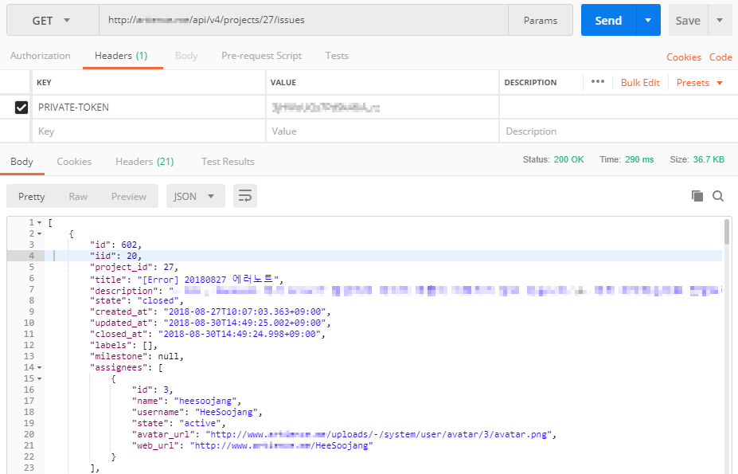
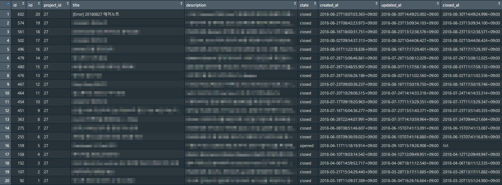
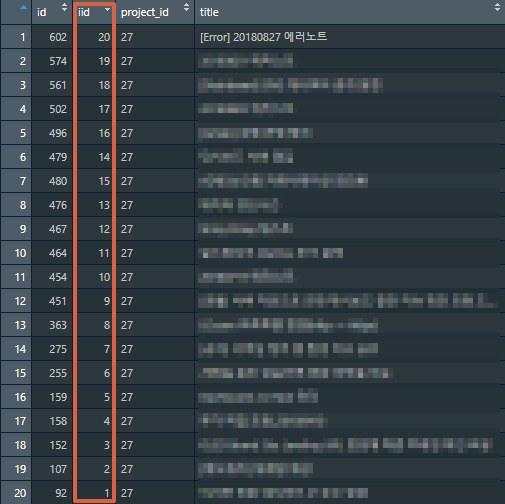
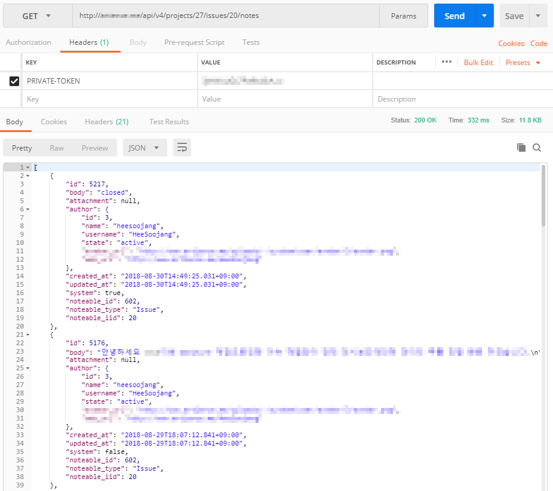
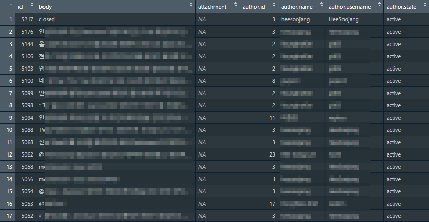
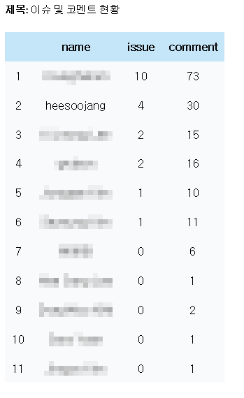

# Gitlab API 활용하기

## ▶ 목 적
AD팀의 이슈 및 코멘트에 대한 인원별 자동 체크 기능

## ▶ 목 차
 - Get Gitlab API Token
 - Gitlab Issue Check by Project
 - Gitlab Comment Check by Issue
 - Create Data Frame
 - Daily Mailing
 - 참고 사이트

### 1. Get Gitlab API Token


필요 내용만 작성하면 간단하게 Token 획득 가능(Expires at을 길게 하는 것을 권장)

### 2. Gitlab Issue Check by Project
API 정보 : [List project issues](https://docs.gitlab.com/ee/api/issues.html#list-project-issues)

- API 신청 방법
```
curl --header "PRIVATE-TOKEN: 9koXpg98eAheJpvBs5tK" https://gitlab.example.com/api/v4/projects/4/issues
```
<br>

- Project Number 확인 방법

<br>

- Postman 사용 방법

<br>

- R 사용 방법
```
git_issue <- httr::GET(url = "http://[Gitlab URL]/api/v4/projects/[Gitlab Project Number]/issues",  add_headers('PRIVATE-TOKEN' = '[API Token]'))
git_issue <- jsonlite::fromJSON(read_html(git_issue) %>% html_text())
```


### 3. Gitlab Comment Check by Issue
API 정보 : [Notes API](https://docs.gitlab.com/ee/api/notes.html#list-project-issue-notes)

- API 신청 방법
```
curl --request GET --header "PRIVATE-TOKEN: 9koXpg98eAheJpvBs5tK" https://gitlab.example.com/api/v4/projects/5/issues/11/notes
```
<br>

- Note Number 확인 방법

<br>

- Postman 사용 방법

<br>

- R 사용 방법
```
git_notes <- httr::GET(url = "http://[Gitlab URL]/api/v4/projects/[Gitlab Project Number]/issues/[Gitlab Note Number]/notes",  add_headers('PRIVATE-TOKEN' = '[API Token]'))
git_notes <- fromJSON(read_html(git_notes) %>% html_text())
```


### 4. Create Data Frame(R)
```
# =========================================================================
# gitlab API
# 인원별로 이슈 및 코멘트 갯수 파악 후 메일 전송
# =========================================================================

library(data.table)
library(httr)
library(jsonlite)
library(dplyr)


# =========================================================================
# 프로젝트 별 이슈 리스트가져오는 함수
# temp <- get_issue.func(project_number.num, token)
# -------------------------------------------------------------------------

get_issue.func <- function(project_number.num, token){
  temp <- httr::GET(url = paste0("http://artience.me/api/v4/projects/",project_number.num,"/issues"), add_headers('PRIVATE-TOKEN' = token))
  temp <- jsonlite::fromJSON(read_html(temp) %>% html_text())
  # Dataframe 안에 Dataframe이 있을 때 dplyr 함수 사용에 제한이 생기기 때문에 해당 열을 빼내는 작업
  temp$name <- temp$author$name
  # 필요 열만 선택
  temp <- temp %>% select(iid, title, description, name)
  return(temp)
}

# =========================================================================


# =========================================================================
# 이슈 별 코멘트 리스트가져오는 함수
# temp <- get_comment.func(project_number.num, 1, token)
# -------------------------------------------------------------------------

get_comment.func <- function(project_number.num, issue_number.num, token){
  temp <- httr::GET(url = paste0("http://artience.me/api/v4/projects/",project_number.num,"/issues/",issue_number.num,"/notes"), add_headers('PRIVATE-TOKEN' = token))
  temp <- fromJSON(read_html(temp) %>% html_text())
  # Dataframe 안에 Dataframe이 있을 때 dplyr 함수 사용에 제한이 생기기 때문에 해당 열을 빼내는 작업
  temp$id <- temp$author$id
  temp$name <- temp$author$name
  temp$username <- temp$author$username
  temp$state <- temp$author$state
  temp$avatar_url <- temp$author$avatar_url
  temp$web_url <- temp$author$web_url
  temp <- temp %>% select(-author)
  return(temp)
}

# =========================================================================


# =========================================================================
# 해당 프로젝트의 인원별 이슈 및 코멘트 갯수 체크 함수
# temp <- check_person.func(project_number.num, token)
# -------------------------------------------------------------------------

check_person.func <- function(project_number.num, token){
  # 이슈 및 코멘트 리스트 추출
  issue_list.df <- get_issue.func(project_number.num, token)
  comment_list.df <- lapply(X = issue_list.df$iid,
                            FUN = get_comment.func,
                            project_number.num = project_number.num,
                            token = token) %>% data.table::rbindlist(.)
  # 이슈 및 코멘트에서 추출한 인원의 중복 제거(코멘트 및 이슈 작성한 인원 파악)
  names.df <- data.frame(name = unique(c(issue_list.df$name, comment_list.df$name)), stringsAsFactors = FALSE)
  # 해당 인원이 이슈 및 코멘트 작성 갯수 파악
  issue_check.df <- issue_list.df %>% select(name) %>% group_by(name) %>% tally()
  comment_check.df <- comment_list.df %>% select(name) %>% group_by(name) %>% tally()
  # 각 Dataframe 하나로 병합
  check.df <- Reduce(list(names.df, issue_check.df, comment_check.df),
                     f = function(x, y){return(left_join(x = x, y = y, by = c("name")))}) %>%
              rename(issue = n.x,
                     comment = n.y) %>%
              replace(is.na(.), 0)
  return(check.df)
}

# =========================================================================

```
### 5. Daily Mailing
```
# =========================================================================
# Daily Mailing
# =========================================================================


library(mailR)
library(dplyr)
library(xtable)

source("~/R_D/gitlab/gitlab_api.R")

project_number.num <- [Project Number]
token <- [PRIVATE-TOKEN]

# 이슈 및 코멘트 작성 횟수
temp <- check_person.func(project_number.num, token) %>% arrange(desc(issue)) %>% mutate(issue = as.character(issue),
                                                                                         comment = as.character(comment))

# R Dataframe을 HTML Table로 변경
html_tab <- gsub("<table border=1>","<table>",as.character(print(xtable(temp), type = "html", print.results=FALSE)))

# Table Design
html_tab <- paste0("<style>
                       table {cellpadding:0; border-collapse: collapse;}
                       th, td {padding: 10px; text-align: center;}
                       th {background-color: #c5e6f8;}
                       td {background-color: #f9fafb;}
                       </style>","<html>", html_tab, "</html>")

# Send Mail
send.mail(from = [From Email],
          to = c([To Email]),
          subject = "이슈 및 코멘트 현황",
          body = html_tab,
          html = TRUE,
          encoding = "utf-8",
          smtp = list(host.name = "smtp.gmail.com", port = 587, user.name = [user.name], passwd = [passwd], ssl = TRUE),
          authenticate = TRUE,
          send = TRUE)
```
<br>

- Daily Mail


### 6. 참고 사이트
https://docs.gitlab.com/ee/api/README.html
